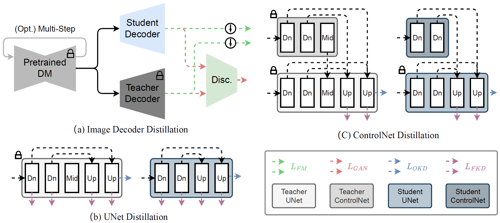
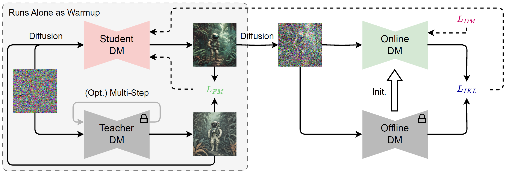
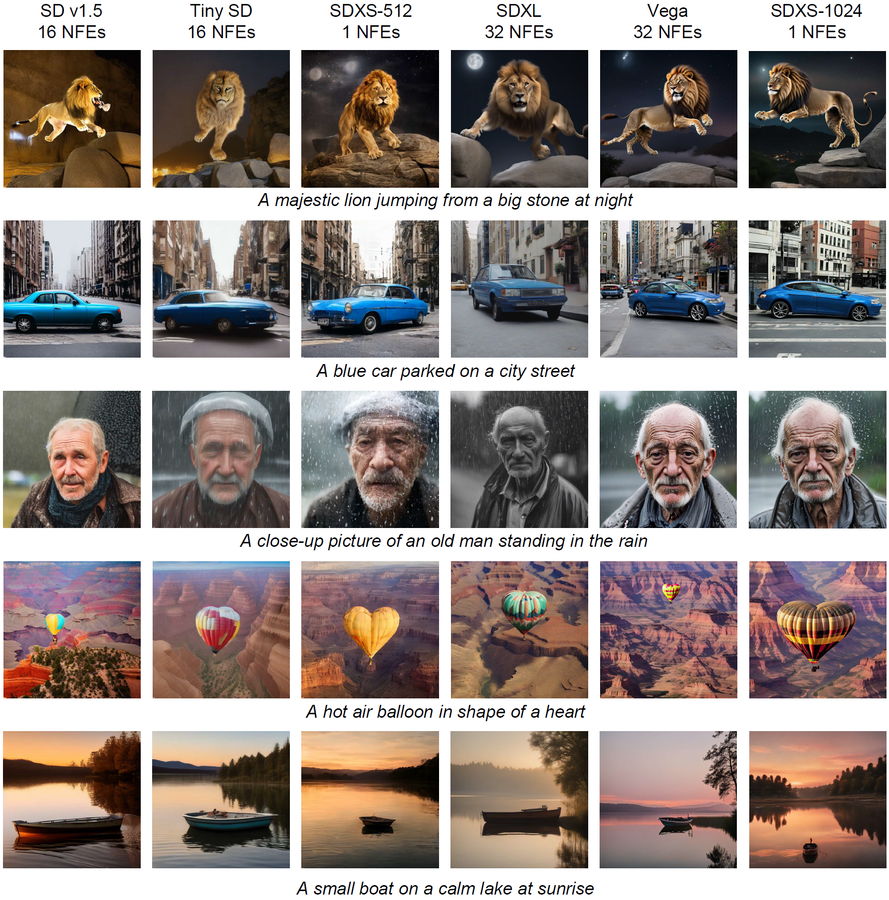
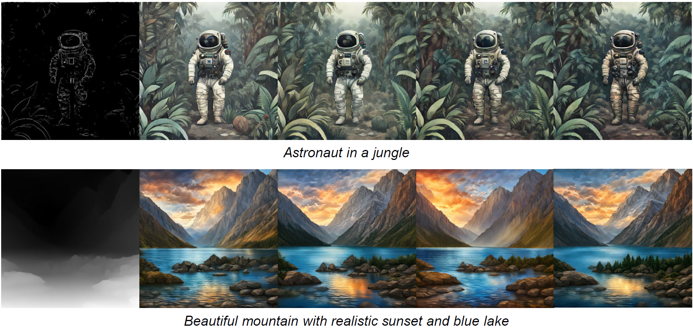

# SDXS: Real-Time One-Step Latent Diffusion Models with Image Conditions

[](https://idkiro.github.io/sdxs)
[]() 
[](https://huggingface.co/IDKiro/sdxs-512-0.9)

> **Abstract:** 
Recent advancements in diffusion models have positioned them at the forefront of image generation. Despite their superior performance, diffusion models are not without drawbacks; they are characterized by complex architectures and substantial computational demands, resulting in significant latency due to their iterative sampling process. To mitigate these limitations, we introduce a dual approach involving model miniaturization and a reduction in sampling steps, aimed at significantly decreasing model latency. Our methodology leverages knowledge distillation to streamline the U-Net and image decoder architectures, and introduces an innovative one-step DM training technique that utilizes feature matching and score distillation. We present two models, SDXS-512 and SDXS-1024, achieving inference speeds of approximately <b>100 FPS</b> (30x faster than SD v1.5) and <b>30 FPS</b> (60x faster than SDXL) on a single GPU, respectively. Moreover, our training approach offers promising applications in image-conditioned control, facilitating efficient image-to-image translation.


Assuming the image generation time is limited to <b>1 second</b>, then SDXL can only use 16 NFEs to produce a slightly blurry image, while SDXS-1024 can generate 30 clear images. Besides, our proposed method can also train ControlNet.


## News

- **March 25, 2024:** [SDXS-512-0.9](https://huggingface.co/IDKiro/sdxs-512-0.9) is released, it is a old version of SDXS-512.


## Method

### Model Acceleration

We train an extremely light-weight image decoder to mimic the original VAE decoder’s output through a combination of output distillation loss and GAN loss. We also leverage the block removal distillation strategy to efficiently transfer the knowledge from the original U-Net to a more compact version.



SDXS demonstrates efficiency far surpassing that of the base models, even achieving image generation at 100 FPS for 512x512 images and 30 FPS for 1024x1024 images on the GPU.


### Text-to-Image

To reduce the NFEs, we suggest straightening the sampling trajectory and quickly finetuning the multi-step model into a one-step model by replacing the distillation loss function with the proposed feature matching loss. Then, we extend the Diff-Instruct training strategy, using the gradient of the proposed feature matching loss to replace the gradient provided by score distillation in the latter half of the timestep.



Despite a noticeable downsizing in both the sizes of the models and the number of sampling steps required, the prompt-following capability of SDXS-512 remains superior to that of SD v1.5. This observation is consistently validated in the performance of SDXS-1024 as well.  



### Image-to-Image

We extend our proposed training strategy to the training of ControlNet, relying on adding the pretrained ControlNet to the score function. 


We demonstrate its efficacy in facilitating image-to-image conversions utilizing ControlNet, specifically for transformations involving canny edges and depth maps.




## Citation

If you find this work useful for your research, please cite our paper:

```bibtex
@article{song2024sdxs,
  author    = {Yuda Song, Zehao Sun, Xuanwu Yin},
  title     = {SDXS: Real-Time One-Step Latent Diffusion Models with Image Conditions},
  journal   = {arxiv},
  year      = {2024},
}
